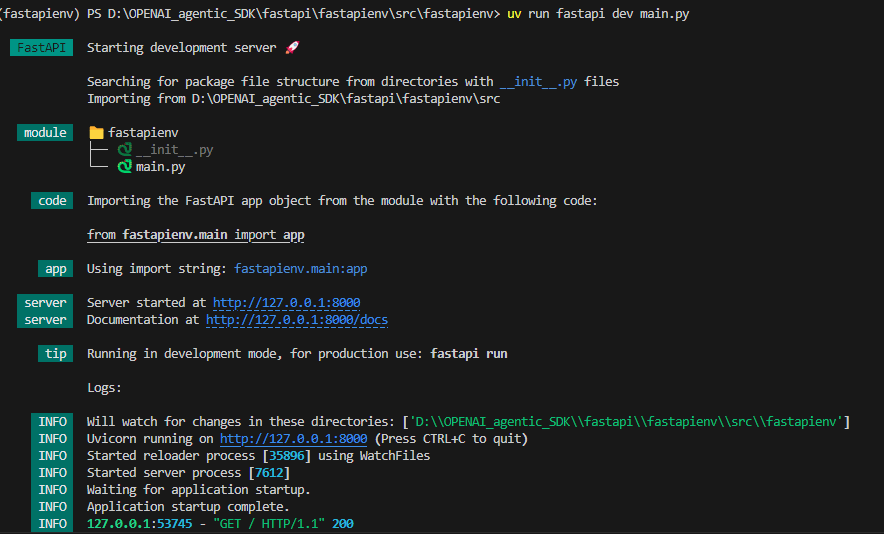
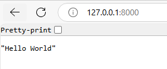
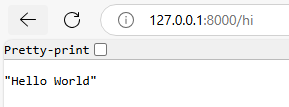

https://fastapi.tiangolo.com/tutorial/path-params/
https://github.com/fastapi/fastapi

uv init --packages fastapienv

uv sync

uv venv
you will get env like that ".venv\Scripts\activate"
copy environment then paste and enter

now you are in new environment

Go to Documentation https://github.com/fastapi/fastapi

uv add "fastapi[standard]"

now go to fastapienv folder and create main.py

copy basic code from documnetionation and paste

'
from typing import Union

from fastapi import FastAPI

app = FastAPI()

@app.get("/")
def read_root():
    return {"Hello": "World"}

@app.get("/items/{item_id}")
def read_item(item_id: int, q: Union[str, None] = None):
    return {"item_id": item_id, "q": q}
    '

Go to folder where main.py is created
cd .\src\fastapienv\

now run command 
uv run fastapi dev main.py

$ fastapi dev main.py

 ╭────────── FastAPI CLI - Development mode ───────────╮
 │                                                     │
 │  Serving at: http://127.0.0.1:8000                  │
 │                                                     │
 │  API docs: http://127.0.0.1:8000/docs               │
 │                                                     │
 │  Running in development mode, for production use:   │
 │                                                     │
 │  fastapi run                                        │
 │                                                     │
 ╰─────────────────────────────────────────────────────╯

INFO:     Will watch for changes in these directories: ['/home/user/code/awesomeapp']
INFO:     Uvicorn running on http://127.0.0.1:8000 (Press CTRL+C to quit)
INFO:     Started reloader process [2248755] using WatchFiles
INFO:     Started server process [2248757]
INFO:     Waiting for application startup.
INFO:     Application startup complete.

Server started at http://127.0.0.1:8000
server   Documentation at http://127.0.0.1:8000/docs

@app.get("/")
def read_root():
    return "Hello World"

if we change rout

@app.get("/hi")
def read_root():
    return "Hello World"

now you can get on this new rout

main2.py

go to documentation fastapi search "user guide and open it"
https://fastapi.tiangolo.com/tutorial/?h=tuto#run-the-code